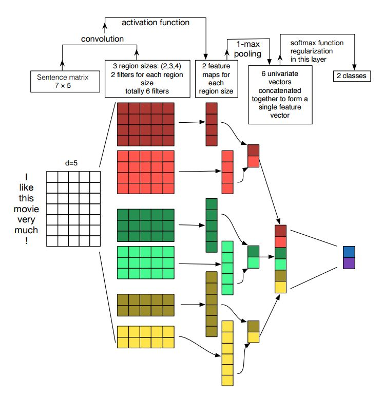

# ROADMAP FOR NLP

## 9. Text Classification

### 9.1 Overview

**Keywords**: TextCNN  VDCNN  fastText  DRNN  

**Object**: Sentiment Analysis, Object Extraction, Categorization

#### Github

a. <https://github.com/brightmart/text_classification> (Tensorflow)

b. <https://github.com/jiangxinyang227/textClassifier> (Tensorflow)

#### Practice

a. 文本分类实战系列文章 (<https://www.cnblogs.com/jiangxinyang/p/10207482.html>) (Tensorflow)

b. 阿里AI工程师教你如何用CNN RNN Attention解决大规模文本分类问题 (<https://www.sohu.com/a/130492867_642762>)

### 9.2 fastText

#### Paper

Bag of Tricks for Efficient Text Classification (<https://arxiv.org/abs/1607.01759>)

#### Source

**Github**: <https://github.com/facebookresearch/fastText>

**Website**: <https://fasttext.cc/>

#### Practice

a. 直接使用Python的fastText库：

```Python
from fastText import train_supervised

model = train_supervised('train.txt', epoch=25, lr=1.0, wordNgrams=2, minCount=1, loss='hs')
N, P, R = model.test('test.txt', k=1)
model.test_label('test.txt', k=1, threshold=0.5)  # Return precision and recall for each label
model.predict('五彩 手机壳', k=1, threshold=0.5)
model.save_model("model.bin")
```

其中，train.txt每行Schema：用__label__表示label，使用**空格逗号空格**分隔label和text，其中label是类别名字或编号，text是用**空格**分隔的各个word

> Schema: __label__0 , 贴膜 金刚膜

b. 还有一种自己搭建模型的方式，不确定是否合理：

**Structure**: inputs-->Embedding-->SpatialDropout1D-->GlobalAveragePooling1D-->Dense-->Softmax/Sigmoid  ???

### 9.3 TextCNN

#### Paper

a. Convolutional Neural Networks for Sentence Classification (<https://arxiv.org/abs/1408.5882>)

**Structure**: Input -> Embedding -> (Conv1D -> GlobalMaxPooling1D) * n_filter_size -> Concatenate -> Dropout -> Dense -> Dropout -> Dense，其中GlobalMaxPooling1D与MaxPooling1D-->Flatten功能相同。



**Points**：

TextCNN的输入Embedding有3种：

- 随机初始化

- Static Pre-trained

- Two-Channel: Static Pre-trained + Dynamic Embedding，其中Dynamic有2种：Pre-trained + Finetuning和随机初始化，Dynamic的作用是，通过对语料的学习，模型可以得到task-specific的信息。

b. 对TextCNN进行调优：A Sensitivity Analysis of (and Practitioners' Guide to) Convolutional Neural Networks for Sentence Classification(<https://arxiv.org/abs/1510.03820>)

论文基于one-layer CNNs，研究了Input Word Vectors、Filter Region Size、Number of Feature Maps for Each Filter Region Size、Activation Function、Pooling Strategy和Regularization等对模型性能的影响，有助于我们参考以选择适合自己的参数。

c. charCNN

**Paper**: Character-level Convolutional Networks for Text Classification-2016 (<https://arxiv.org/abs/1509.01626>)

**Practice**: 文本分类实战（三）—— charCNN模型 (<https://www.cnblogs.com/jiangxinyang/p/10207686.html>)

**Source**: <https://github.com/jiangxinyang227/textClassifier>

#### Source

a. Yao(Keras)

```Python
from keras.layers import Input, Conv1D, GlobalMaxPooling1D, Concatenate, Dropout, Dense
from keras.models import Model
def TextCNNModel(input_shape, embedding_layer):
    sentences = Input(input_shape, dtype='int32')
    X = embedding_layer(sentences)                          # (None, maxlen, emb_dim)
    Xs = []
    for fsize in [2, 3, 4]:
        Xi = Conv1D(128, fsize, activation='relu')(X)       # (None, maxlen-fsize+1, 128)
        Xi = GlobalMaxPooling1D()(Xi)                       # (None, 128) Equals 2 lines above
        Xs.append(Xi)
    X = Concatenate(axis=-1)(Xs)                            # (None, 128*3)
    X = Dropout(0.5)(X)
    X = Dense(units=32, activation='relu')(X)               # (None, 32)
    X = Dense(units=1, activation='sigmoid')(X)             # (None, 1)
    return Model(sentences, X)
```

b. <https://github.com/jiangxinyang227/textClassifier> (Tensorflow)

#### Practice

### 9.4 TextRNN

**Structure1**: Embedding -> BiLSTM -> Average -> Softmax


**Structure2**: Embedding -> BiLSTM -> Dropout -> LSTM -> Dropout -> Softmax


#### Source

<https://github.com/brightmart/text_classification> (Tensorflow)

#### Practice

1. 其实就是使用LSTM或BiLSTM按一般方式去处理Sequnce，没什么花样。

### 9.5 TextRCNN

#### Paper

Recurrent Convolutional Neural Networks for Text Classification (<https://www.aaai.org/ocs/index.php/AAAI/AAAI15/paper/view/9745/9552>)

**Structure**

Recurrent Structure(Convolutional Layer) -> MaxPooling -> Dense(Softmax)

Representation of Current Word = [ Left_context_vector, Current_word_embedding, Right_context_vecotor]

For Left_context Cl(w4), it uses a recurrent structure, a non-linearity transform of previous word w3('stroll') and left previous context Cl(w3)


#### Source

a. <https://github.com/brightmart/text_classification> (Tensorflow)

核心代码：生成Left_context_vector和Right_context_vector，注意是双向的，顺序生成各个Left_context_vector，倒序生成各个Right_context_vector

```Python
# left与right相似，本质上都是相乘相加再激活
# Context(n) = Activation(W * Context(n-1) + W_s * Embedding(n-1))

# Size：context_left-[batch_size, embed_size]  W_l-[embed_size, embed_size]  embedding_previous-[batch_size, embed_size]
def get_context_left(self, context_left, embedding_previous):
    left_h = tf.matmul(context_left, self.W_l) + tf.matmul(embedding_previous, self.W_sl)
    context_left = self.activation(left_h)
    return context_left    # [None,embed_size]

def get_context_right(self, context_right, embedding_afterward):
    right_h = tf.matmul(context_right, self.W_r) + tf.matmul(embedding_afterward, self.W_sr)
    context_right = self.activation(right_h)
    return context_right    # [None,embed_size]
```

b. <https://github.com/jiangxinyang227/textClassifier> (Tensorflow)

#### Practice

a. 文本分类实战（六）—— RCNN模型 (<https://www.cnblogs.com/jiangxinyang/p/10208290.html>) (Tensorflow)

### 9.6 VDCNN

#### Paper

Very Deep Convolutional Networks for Text Classification - Facebook2017 (<https://arxiv.org/abs/1606.01781)>

#### Source

**Github**: <https://github.com/lethienhoa/Very-Deep-Convolutional-Networks-for-Natural-Language-Processing> (Tensorflow)

### 9.7 DRNN

#### Paper

#### Source

### 9.8 Others

multi_channel_CNN, deep_CNN, LSTM_CNN, Tree-LSTM

#### Practice

a. 详解文本分类之DeepCNN的理论与实践 (<https://mp.weixin.qq.com/s?__biz=MzI3ODgwODA2MA==&mid=2247485837&idx=1&sn=1b8f6e0f1ec21d3b73871179f0471428&chksm=eb501d1edc2794081a51eba592da28880bb572caf5bd174869211f7c10719b3c59e703f2ef6b&scene=21#wechat_redirect>)

### 9.9 Summary
