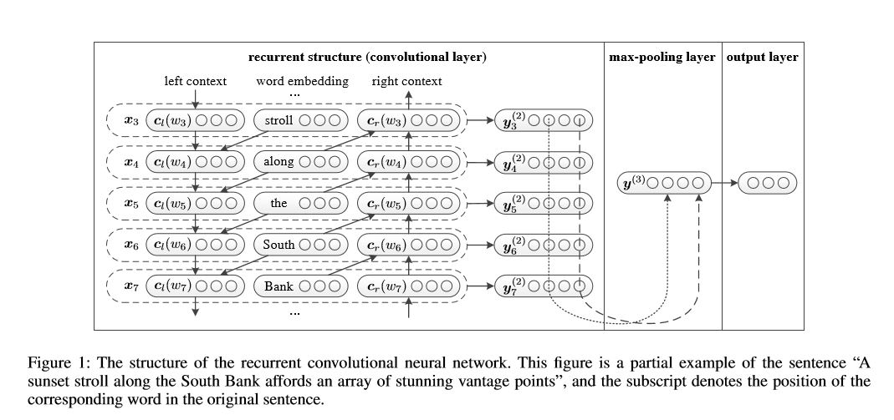

# 9. Text Classification

YAO's: <https://github.com/liuyaox/text_classification> (Keras & PyTorch)


## 9.1 Overview

#### Code

- <https://github.com/brightmart/text_classification> (Tensorflow)

    模型有：

- <https://github.com/brightmart/ai_law> (Tensorflow)

    All kinds of baseline models for long text classificaiton (text categorization): 

    HAN, TextCNN, DPCNN, CNN-GRU, GRU-CNN, Simple Pooling, Transformer(todo)

- <https://github.com/jiangxinyang227/textClassifier> (Tensorflow)

- <https://github.com/649453932/Chinese-Text-Classification-Pytorch> (PyTorch)

    中文文本分类，TextCNN，TextRNN，FastText，TextRCNN，BiLSTM_Attention，DPCNN，基于pytorch，开箱即用。

- <https://github.com/pengming617/text_classification> (Tensorflow)

    文本分类的许多方法，主要涉及到TextCNN，TextRNN, LEAM, Transformer，Attention, fasttext, HAN等


#### Practice

- [文本分类实战系列文章](https://www.cnblogs.com/jiangxinyang/p/10207482.html) (Tensorflow)

- [阿里AI工程师教你如何用CNN RNN Attention解决大规模文本分类问题](https://www.sohu.com/a/130492867_642762)


#### Article

- 【Great】[如何到top5%？NLP文本分类和情感分析竞赛总结](https://mp.weixin.qq.com/s?__biz=MzI3ODgwODA2MA==&mid=2247486159&idx=1&sn=522345e275df807942c7b56b0054fec9)


#### Library

- NeuralNLP-NeuralClassifier: <https://github.com/Tencent/NeuralNLP-NeuralClassifier>

    An Open-source Neural Hierarchical Multi-label Text Classification Toolkit from Tencent.


#### Competition

**2018-DC-“达观杯”文本智能处理挑战赛**:

> **单标签多分类**问题，共有19种分类，原始数据是字id序列和词id序列

- 【Great！】<https://github.com/ShawnyXiao/2018-DC-DataGrand-TextIntelProcess>

    冠军 (1st/3131)，任务是通过长文本的字和词的序列数据，判断文本类别。

    特征构建：TFIDF特征，LDA特征，LSI特征，Word2Vec特征

    传统模型：MultinomialNB, BernoulliNB, LinearSVC, GBDT, MLP, LightGBM, LR等 (对模型融合的提升是巨大的)

    深度学习模型：Enhanced GRU(GRU+Capsule), Reinforced Embedding(Capsule+Attention) + Reinforced GRU(GRU+Capsule+Attention), Reinforced CNN(CNN+Capsule+Attention) + Reinforce GRU

    模型技巧：Stacking

    **YAO**: 4个特征如何加工，如何整合？

- 【Great！】<https://github.com/nlpjoe/daguan-classify-2018> (Keras)

    Top18 解决方案，使用模型：Attention, Attention+RNN, Capsule, ConvLSTM, DPCNN, LSTM-GRU, RCNN, SimpleCNN, TextCNN, TextRNN, LightGBM

    **YAO**: 
    
    - Baseline有2种：LR和LinearSVC，**特征都只有TFIDF特征**，评估指标都是Accuracy和F1值，都有非CV版和CV版，其中CV版**手动进行K次模型训练应用和评估**
    - 模型：首先定义BasicModel, BasicDeepModel, BasicStaticModel，并实现通用方法如计算评估指标, 模型训练与评估等；随后继承BasicDeepModel来实现各种分类模型，继承BasicStaticModel来实现XGBoost和LightGBM模型
    - 特征：自己训练Word2Vec, LSA特征
    - Trick: **数据增强(打乱原样本序列顺序生成新样本)**， 模型融合使用Stacking

- <https://github.com/hecongqing/2018-daguan-competition> (Keras)

    Rank4

- <https://github.com/Rowchen/Text-classifier> (Tensorflow)

    Rank 8/3462

- <https://github.com/moneyDboat/data_grand> (PyTorch)

    Top10 解决方案（10/3830）


## 9.2 Multi-label Classification

#### Code

- <https://github.com/linjian93/toxic_comment_classification> (PyTorch)

    采用LSTM/C-LSTM/CNN等方法，对评论进行多标签分类

    **YAO**: 使用了PyTorch中的 Dataset 和 Dataloader，可以学习一下

- <https://github.com/junyu-Luo/Multi-label_classification> (Tensorflow)

    使用GRU+attention进行多标签二分类

- <https://github.com/zhangfazhan/Multi_Label_TextCNN> (Tensorflow)

    textcnn多标签文本分类

- <https://github.com/chenzhi1992/Multi-Label-Text-Classification> (Tensorflow)

    bilstm+attention, multi label text classify


#### Competition

**2017知乎看山杯 多标签 文本分类**:

- <https://github.com/yongyehuang/zhihu-text-classification> (Tensorflow)

    ye组(第六名) 解题方案

- <https://github.com/coderSkyChen/zhihu_kanshan_cup_2017> (keras)

    Rank 9

    **Article**: 【Great!】[大规模文本分类实践-知乎看山杯总结](http://coderskychen.cn/2017/08/20/zhihucup/)


## 9.2 fastText

#### Paper

[Bag of Tricks for Efficient Text Classification - Facebook2016](https://arxiv.org/abs/1607.01759)

#### Code

- **Github**: <https://github.com/facebookresearch/fastText>

- **Website**: <https://fasttext.cc/>

#### Library

- gensim: <https://radimrehurek.com/gensim/models/fasttext.html>

- skift: <https://github.com/shaypal5/skift>

    scikit-learn wrappers for Python fastText

#### Practice

- 直接使用Python的fastText库
  
  ```Python
  from fastText import train_supervised

  model = train_supervised('train.txt', epoch=25, lr=1.0, wordNgrams=2, minCount=1, loss='hs')
  N, P, R = model.test('test.txt', k=1)
  model.test_label('test.txt', k=1, threshold=0.5)  # Return precision and recall for each label
  model.predict('五彩 手机壳', k=1, threshold=0.5)
  model.save_model("model.bin")
  ```

  其中，train.txt每行Schema：用__label__表示label，使用**空格逗号空格**分隔label和text，其中label是类别名字或编号，text是用**空格**分隔的各个word

  > Schema: __label__0 , 贴膜 金刚膜

- 还有一种自己搭建模型的方式，不确定是否合理

  **Structure**: inputs-->Embedding-->SpatialDropout1D-->GlobalAveragePooling1D-->Dense-->Softmax/Sigmoid  ???

- <https://github.com/panyang/fastText-for-AI-Challenger-Sentiment-Analysis>

    AI Challenger 2018 Sentiment Analysis Baseline with fastText


## 9.3 TextCNN

#### Paper

- [Convolutional Neural Networks for Sentence Classification - NYU2014](https://arxiv.org/abs/1408.5882)

  **Structure**: Input -> Embedding -> (Conv1D -> GlobalMaxPooling1D) * n_filter_size -> Concatenate -> Dropout -> Dense -> Dropout -> Dense，其中GlobalMaxPooling1D与MaxPooling1D-->Flatten功能相同。

  

  **Key Points**：

  TextCNN的输入Embedding有3种：

  - 随机初始化

  - Static Pre-trained

  - Two-Channel: Static Pre-trained + Dynamic Embedding，其中Dynamic有2种：Pre-trained + Finetuning和随机初始化，Dynamic的作用是，通过对语料的学习，模型可以得到task-specific的信息。

- 对TextCNN进行调优
  
    **Paper**: [A Sensitivity Analysis of (and Practitioners' Guide to) Convolutional Neural Networks for Sentence Classification - UTEXAS2016](https://arxiv.org/abs/1510.03820)

    论文基于one-layer CNNs，研究了Input Word Vectors、Filter Region Size、Number of Feature Maps for Each Filter Region Size、Activation Function、Pooling Strategy和Regularization等对模型性能的影响，有助于我们参考以选择适合自己的参数。

- charCNN

  **Paper**: [Character-level Convolutional Networks for Text Classification - NYU2016](https://arxiv.org/abs/1509.01626)

  **Practice**: [文本分类实战（三）—— charCNN模型](https://www.cnblogs.com/jiangxinyang/p/10207686.html)

  **Code**: <https://github.com/jiangxinyang227/textClassifier>

#### Code

- Yao(Keras)

    ```Python
    from keras.layers import Input, Conv1D, GlobalMaxPooling1D, Concatenate, Dropout, Dense
    from keras.models import Model

    def TextCNNModel(input_shape, embedding_layer):
        sentences = Input(input_shape, dtype='int32')
        X = embedding_layer(sentences)                          # (None, maxlen, emb_dim)
        X = BatchNormalization()(X)
        Xs = []
        for fsize in [2, 3, 4]:
            Xi = Conv1D(128, fsize, activation='relu')(X)       # (None, maxlen-fsize+1, 128)
            Xi = GlobalMaxPooling1D()(Xi)                       # (None, 128)
            Xs.append(Xi)
        X = Concatenate(axis=-1)(Xs)                            # (None, 128*3)
        X = Dropout(0.5)(X)
        X = Dense(units=32, activation='relu')(X)               # (None, 32)
        X = Dense(units=1, activation='sigmoid')(X)             # (None, 1)
        return Model(sentences, X)
    ```

- <https://github.com/alexander-rakhlin/CNN-for-Sentence-Classification-in-Keras> (Keras)

- <https://github.com/jiangxinyang227/textClassifier> (Tensorflow)

#### Practice

- [tf18: 根据姓名判断性别](https://blog.csdn.net/u014365862/article/details/53869732)


## 9.4 TextRNN

其实就是使用LSTM或BiLSTM按一般方式去处理Sequnce，没什么花样。

**Structure1**: Embedding -> BiLSTM -> Average -> Softmax


**Structure2**: Embedding -> BiLSTM -> Dropout -> LSTM -> Dropout -> Softmax


**Structure3**: Embedding -> BiLSTM -> Attention -> Softmax

#### Code

<https://github.com/brightmart/text_classification> (Tensorflow)

#### Practice

- <https://github.com/cjymz886/text_rnn_attention> (Tensorflow)

    嵌入Word2vec词向量的RNN+ATTENTION中文文本分类


## 9.5 TextRCNN

#### Paper

[Recurrent Convolutional Neural Networks for Text Classification - CAS2015](https://www.aaai.org/ocs/index.php/AAAI/AAAI15/paper/view/9745/9552)

**Structure**

Recurrent Structure(Convolutional Layer) -> MaxPooling -> Dense(Softmax)

Representation of Current Word = [Left_context_vector, Current_word_embedding, Right_context_vecotor]

For Left_context Cl(w4), it uses a recurrent structure, a non-linearity transform of previous word w3('stroll') and left previous context Cl(w3)



#### Code

- <https://github.com/brightmart/text_classification> (Tensorflow)

    核心代码：生成Left_context_vector和Right_context_vector，注意是双向的，顺序生成各个Left_context_vector，倒序生成各个Right_context_vector

    ```Python
    # left与right相似，本质上都是：前Context与前Embedding相加后激活
    # Context(i) = Activation(W * Context(i-1) + W_s * Embedding(i-1))

    # Size：context_left-[batch_size, embed_size]  W_l-[embed_size, embed_size]  embedding_previous-[batch_size, embed_size]
    def get_context_left(self, context_left, embedding_previous):
        left_h = tf.matmul(context_left, self.W_l) + tf.matmul(embedding_previous, self.W_sl)
        context_left = self.activation(left_h)
        return context_left    # [None, embed_size]

    def get_context_right(self, context_right, embedding_afterward):
        right_h = tf.matmul(context_right, self.W_r) + tf.matmul(embedding_afterward, self.W_sr)
        context_right = self.activation(right_h)
        return context_right    # [None, embed_size]
    ```

- <https://github.com/jiangxinyang227/textClassifier> (Tensorflow)

   解读：[文本分类实战（六）—— RCNN模型](https://www.cnblogs.com/jiangxinyang/p/10208290.html) (Tensorflow)

- <https://github.com/roomylee/rcnn-text-classification> (Tensorflow)

- <https://github.com/airalcorn2/Recurrent-Convolutional-Neural-Network-Text-Classifier> (Keras)

    Slightly modified Keras implementation of TextRCNN

    **YAO**: 论文里公式1和2实现得似乎不对，处理left和right时没有考虑word embedding ???


## 9.6 VDCNN

#### Paper

[Very Deep Convolutional Networks for Text Classification - Facebook2017](https://arxiv.org/abs/1606.01781)

#### Code

- <https://github.com/lethienhoa/Very-Deep-Convolutional-Networks-for-Natural-Language-Processing> (Tensorflow)


## 9.7 DRNN

#### Paper

[Disconnected Recurrent Neural Networks for Text Categorization - iFLYTEK2018](https://aclweb.org/anthology/P18-1215)

#### Code

- <https://github.com/zepingyu0512/disconnected-rnn> (Keras)

- <https://github.com/liuning123/DRNN> (Tensorflow)


## 9.8 HAN

Please go to 08-Seq2Seq_Attention_and_Transformer.md


## 9.9 DPCNN

#### Paper

[Deep Pyramid Convolutional Neural Networks for Text Categorization - Tencent2017](https://ai.tencent.com/ailab/media/publications/ACL3-Brady.pdf)

单词级别的深层CNN模型，来捕捉文本的全局语义表征，该模型在不增加太多的计算开销的情况下，通过增加网络深度可以获得最佳的性能

#### Code

- <https://github.com/Cheneng/DPCNN> (PyTorch)

    A simple version for DPCNN


## 9.8 multiChannelCNN & DeepCNN & LSTM-CNN & Tree-LSTM

multiChannelCNN: 同一个Sequence，用多个Embedding，其一是随机初始化，其二是预训练Embedding如Word2Vec或GloVe等，然后Concatenate

DeepCNN: 其实是multiLayerCNN

LSTM-CNN:

Tree-LSTM:

### 9.8.1 multiChannelCNN

#### Code

- <https://github.com/zenRRan/Sentiment-Analysis/blob/master/models/multi_channel_CNN.py> (PyTorch)

#### Article

- [详解文本分类之多通道CNN的理论与实践](https://mp.weixin.qq.com/s?__biz=MzI3ODgwODA2MA==&mid=2247485817&idx=1&sn=fc0c3a4a5f6afc111b57045ff929cc2b)


### 9.8.2 DeepCNN

#### Code

- <https://github.com/zenRRan/Sentiment-Analysis/blob/master/models/Multi_layer_CNN.py> (PyTorch)

#### Article

- [详解文本分类之DeepCNN的理论与实践](https://mp.weixin.qq.com/s?__biz=MzI3ODgwODA2MA==&mid=2247485837&idx=1&sn=1b8f6e0f1ec21d3b73871179f0471428)


### 9.8.3 LSTM-CNN


### 9.8.4 Tree-LSTM


## 9.11 Others

#### Paper

- [Document Modeling with Gated Recurrent Neural Network for Sentiment Classification (EMNLP 2015)](https://www.aclweb.org/anthology/D15-1167)

    利用GRU对文档进行建模的情感分类模型：首先将文本映射为向量，然后利用CNN/LSTM进行句子向量表示，输入到GRU中，得到文档向量表示，最后输送给Softmax层，得到标签的概率分布。

- [Recurrent Neural Network for Text Classification with Multi-Task Learning (IJCAI 2016)](https://arxiv.org/abs/1605.05101)

    针对文本多分类任务，提出了基于RNN的三种不同的共享信息机制对具有特定任务和文本进行建模：所有任务共享同1个LSTM层，每个任务具有自己独立的LSTM层，除1个共享的BLSTM层外每个任务有自己独立的LSTM层。

- DeepMoji - [Using millions of emoji occurrences to learn any-domain representations for detecting sentiment, emotion and sarcasm - MIT2017](https://arxiv.org/abs/1708.00524)

    使用数以百万计的表情符号来学习任何领域的表情符号来检测情绪、情绪和讽刺，提出了DeepMoji模型，并取得了具有竞争性的效果。同时，DeepMoji模型在文本分类任务上也可以取得不错的结果。

    **Github**: <https://github.com/bfelbo/DeepMoji> (Keras)

- [Investigating Capsule Networks with Dynamic Routing for Text Classification - CAS2018)](https://arxiv.org/abs/1804.00538)

    一种基于胶囊网络的文本分类模型，并改进了Sabour等人提出的动态路由，提出了三种稳定动态路由。

    **Github**: <https://github.com/andyweizhao/capsule_text_classification> (Tensorflow, Keras)

- RNN-Capsule - [Sentiment Analysis by Capsules -THU2018](http://coai.cs.tsinghua.edu.cn/hml/media/files/p1165-wang.pdf)

    RNN-Capsule首先使用RNN捕捉文本上下文信息，然后将其输入到capsule结构中：用注意力机制计算capsule表征 --> 用capsule表征计算capsule状态的概率 --> 用capsule表征以及capsule状态概率重构实例的表征

- GCN - [Graph Convolutional Networks for Text Classification - Northwestern2018)](https://arxiv.org/abs/1809.05679)

    一种基于graph convolutional networks(GCN)进行文本分类，构建了一个包含word节点和document节点的大型异构文本图，显式地对全局word利用co-occurrence信息进行建模，然后将文本分类问题看作是node分类问题。

    **Github**: <https://github.com/yao8839836/text_gcn> (Tensorflow)


## 10. 12 Traditional Method

#### 